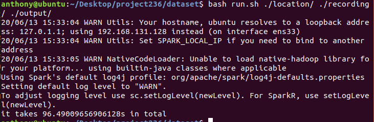

# CS236 Project: Find out Which States in The US Have The Most Stable Rainfall

## Name: Zhizhi Wang

## SID: 862188792

## Overall Description
The whole project need to find out which states in the US have the most stable rainfall. We need to combine the given two dataset to calculate the final result. I divide my project into four parts

First, it is to generate the location information through the given .csv file because we need to use it shatter which is the data of US.

Next, it is to get the useful information from the .txt file and store it into one .csv file because .txt file contains too much useless infomation and it has many headers which should be ignored.

Then, it is to generate the recording file which contains the information of each month's rainfall of each state in the US because we need to combine it with the file which contains location information.

Last, it is to genrate the Final result.

## Description of Each Step Job

Step1 will select the states in the US. we need to use Spark to select USAF, CTRY, STATE columns. the filter condition should be set as CTRY = "US" and STATE is not null. USAF is for later use to combine this dataset with the other one.After we get the data we want, we can only store USAF and STATE these two columns in the locations.csv file.

Step2 is like one feature selectiing process. As the Dataset information shows, lots of information can be ignoreds so I just select the columns I need, They are STN---(which is matched with USAF), YEARMODA(which represents the time, but we only need the month information), PRCP(which is the precipitation)

For the PRCP, to calculate its value, I use one hashmap to map its last number to the multiplier. For example, if it is 'A', the multiplier should be 4. If it is 'C', it should be 1.5.

Because we don't care about the years, so I store all useful infromation of these four .txt file into one middle_result.csv file

Step3 is to calculate each month's precipitation through sql command which is supproted by spark. we need to group each state and each month.

Step4 is to join the results of step 1 and step 3 together. We need to set the join condition as USAF == STN---. Then, it is to find the maximum and minimum precipitation of each state and their corresponding month and calculate their differences, which is the standard for ordering.

## Total Runtime

The total runtime is 120.876s

## Run this program
$1 is the path of the folder of the location file
$2 is the path of the folder of the recording files
$3 is the path of the folder for the output file
run the command "bash run.sh" $1 $2 $3

